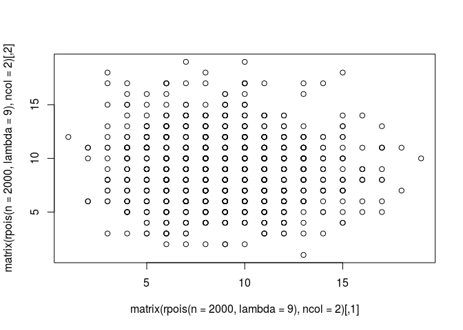

Writing reproducible papers with RMarkdown - a repo template
================

<!-- README.md is generated from README.Rmd. Please edit that file -->
User guide
----------

This repo is designed to make reproducible and open source write-ups easy. It has minimal dependencies and is as simple as possible whilst retaining the key features that any decent paper template repo should have. These features, and how to use them, are listed below:

-   [references.bib](references.bib): Add your references here in .bib format. Read more about the trusty .bib format at [bibtex.org](http://www.bibtex.org/Format/) or check-out an excellent paper on handling `.bib` files in R based on the **RefManageR** package (McLean 2014).
-   [figures/](): this is where to store your figures.
-   [input/](https://github.com/Robinlovelace/rmarkdown-paper-repo/tree/master/input): put public facing example data here
-   [output/](https://github.com/Robinlovelace/rmarkdown-paper-repo/tree/master/output): folder of output data
-   [code/](https://github.com/Robinlovelace/rmarkdown-paper-repo/tree/master/code): folder to place your reproducible scripts, in R or another language. We refrain from using a folder called R as that could conflict with future efforts to convert your paper into an R package.
-   [README.Rmd](): the document your reading. You can write you paper as a `github_document` in the README for maximum simplicity and ease of viewing. Later you could change the output to something more fancy, e.g. using the following YAML heading, which makes use of the [**rticles**](https://github.com/rstudio/rticles) package:

<!-- -->

    ---
    title: 'The title of your paper'
    author:
    - Robin Lovelace (University of Leeds)
    - Another Person (University of Life)
    csl: ../documents/elsevier-harvard.csl # the reference format
    output:
      pdf_document:
        fig_caption: yes
        keep_tex: yes
        number_sections: yes
    fontsize: 12pt
    bibliography: references.bib
    ---

Introduction
------------

Reproducibility is an increasingly important (some would say vital) component of academic research and, thanks to new software, is increasingly easy to implement (Jim’enez et al. 2017). For a detailed account of how to write reproducible papers in the context of recent versions of R/RStudio, please refer to an article by [Roel Hogervorst](https://www.r-bloggers.com/writing-manuscripts-in-rstudio-easy-citations/).

For more on the subject, please see the bookdown package, which is explained in an online [book](https://bookdown.org/yihui/bookdown/) (Xie 2016), and the [CRAN Task View](https://cran.r-project.org/web/views/ReproducibleResearch.html) on reproducible research.

Methods
-------

A great benefit of RMarkdown is that you can embed your code (revealed or hidden with `echo=FALSE`) to show exactly how your results were generated. To provide an example, below is the code that was used to generate the `references.bib` file in this repo:

``` r
devtools::install_github("ropensci/RefManageR")
## Skipping install of 'RefManageR' from a github remote, the SHA1 (bd92bf7b) has not changed since last install.
##   Use `force = TRUE` to force installation
library(RefManageR)
refs = ReadPubMed(query = "Reproducibility")
pkg_ref1 = as.BibEntry(citation(package = "RefManageR"))
pkg_ref2 = as.BibEntry(citation(package = "bookdown"))
refs = c(refs, pkg_ref1, pkg_ref2)
WriteBib(refs, "references.bib")
## Writing 23 Bibtex entries ...
## OK
## Results written to file 'references.bib'
```

Other useful commands for setting up paper repos:

``` r
dir.create("input") # create a folder
## Warning in dir.create("input"): 'input' already exists
input1 = data.frame(x = 1:9)
input1 = readr::write_csv(input1, "input/example-input1.csv")
```

To source code stored in the code directory, you can use the `source()` function:

``` r
source("code/process-data.R")
```

Results
-------

You can also include plot, as illustrated in the text below which generates Figure 1.

``` r
plot(matrix(rpois(n = 2e3, lambda = 9), ncol = 2))
```



Conclusion
----------

Conclusions go here.

In conclusion this template repo provides some ideas and content that should help you create a more reproducible workflow when writing R code. To test if it's reproducible, try to reproduce it:

-   Clone or download and unzip the repo, e.g. by pressing the `Clone or Download` button at [github.com/Robinlovelace/rmarkdown-paper-repo](https://github.com/Robinlovelace/rmarkdown-paper-repo/archive/master.zip).
-   Open the project in RStudio, e.g. by File &gt; Open File.
-   Open the README.Rmd file and click on the 'knit' button to see if it rebuilds.

There are many further steps you could take, including creating a Docker container, Continuous Integration and package development. However, I think this small repo template should serve most paper writing needs. As Albert Einstein [put it](http://quoteinvestigator.com/2011/05/13/einstein-simple/):

> It can scarcely be denied that the supreme goal of all theory is to make the irreducible basic elements as simple and as few as possible without having to surrender the adequate representation of a single datum of experience.

In conclusion, this small template repo provides some basic guidance and content that should make reproducible report/paper writing straightforward and fun.

References
----------

Jim’enez, Rafael C, Mateusz Kuzak, Monther Alhamdoosh, Michelle Barker, B’er’enice Batut, Mikael Borg, Salvador Capella-Gutierrez, et al. 2017. “Four Simple Recommendations to Encourage Best Practices in Research Software.” *F1000Research* 6. doi:[10.12688/f1000research.11407.1](https://doi.org/10.12688/f1000research.11407.1).

McLean, Mathew William. 2014. *Straightforward Bibliography Management in R Using the Refmanager Package*. <http://arxiv.org/abs/1403.2036>.

Xie, Yihui. 2016. *Bookdown: Authoring Books and Technical Documents with R Markdown*. Boca Raton, Florida: Chapman; Hall/CRC. <https://github.com/rstudio/bookdown>.
